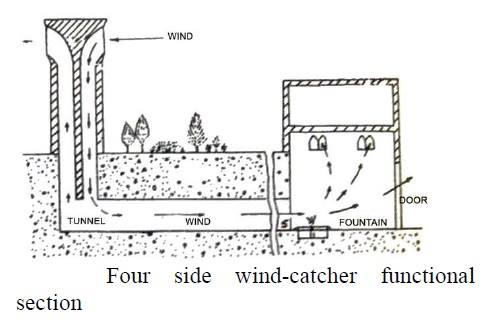

# Construction

## Wind catcher

A Wind tower is used to convey the wind current to
interior spaces of buildings in order to provide living
comfort for occupiers. In Iranian architecture a wind
tower is a combination of inlet and outlet openings.
Wind tower is divided by partitions to make disparate shafts.
One of the shafts operates all the time to receive the
breeze and the other three shafts work as outlet air
passages. They convey the stuffiness out of the living
space based on the chimney effect. The chimney effect is
based on the principle that air density increases with
temperature increase. The difference in temperature
between the interior and exterior parts of a building and
between different regions creates different pressures and
result in air currents .

