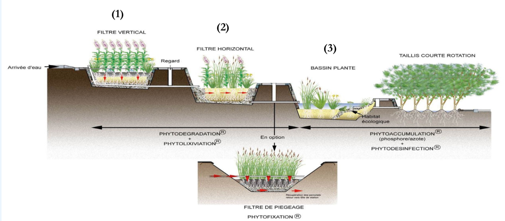

# Environnement

## Eau

### Phytoépuration

#### Stations à filtres plantés de roseaux (FPR)

Elles sont très fréquentes. L’eau séjourne dans une série de filtres à phragmites, de
bassins à macrophytes, et une forêt humide, dont l’activité des bactéries
présentes dans la rhizosphère favorise la dépollution.

- (1) Aérobie, dégradation de la matière organique, élimination de la pollution azotée et phosphorée. Peut être alimenté par les eaux usées brutes.
- (2) Milieu anoxique, saturé en eau. Traitement des polluants restants, fin de l’épuration des composés azotés.
- (3) Eau évapotranspirée, ou infiltrée dans le sol, ou rejetée dans le milieu

Autres possibilités:

- lagunage à microphytes
- bassin de finition à hydrophytes

#### Plantes

- Roseaux (Phragmites australis) : les plus utilisées pour dépolluer et traiter les charges organiques.
- Massettes (Typha sp.) : capables de dépolluer les milieux proches de l’anoxie, dégradent les HAP et composés chlorés, très résistantes.
- Carex (Carex sp.) : performants pour la désinfection, piègent les métaux « lourds ».
- Autres : Iris, Scirpe, Joncs, Potamots...

### Eau de pluie

Capter l'eau de pluie et la stocker est une pratique qui remonte à des civilisations pré-romaines. Cependant dans nos sociétés industrielles, cette pratique a quasiment disparu depuis l'apparition des réseaux d'eau potable.
Face à une consommation d’eau toujours croissante, et surtout face à un enjeu écologique inquiétant, il devient nécessaire de trouver des solutions alternatives visant à réduire la consommation d’eau potable, comme la récupération d'eau de pluie.
Certains usages de l’eau ne nécessitent pas toujours la qualité d’eau potable. Sur les 250 litres d’eau potable que nous utilisons par personne et chaque jour, seulement 7 % correspondent à nos besoins pour la boisson et l’alimentation.
C’est pourquoi, la récupération des eaux pluviales pour certains usages intérieurs et extérieurs ne nécessitant pas d’eau potable (arrosage des
espaces verts, lavage de voiture, chasse d’eau des toilettes, lavage de sols) est une excellente solution de substitution. .
L’eau de pluie est de bonne qualité mais elle se dégrade en ruisselant sur des surfaces imperméabilisées et contaminées par divers polluants. Il est donc intéressant de valoriser cette eau et de l’utiliser avant qu’elle ne soit polluée, dès la descente des toitures.

#### Avantages

L’eau de pluie permet :
• d’économiser l’eau potable,
• de préserver les ressources en eau des rivières et des nappes phréatiques,
• d’économiser l’énergie nécessaire au captage, au traitement et au transport de l’eau.

#### Installation

L’installation est simple : il s’agit d’acheminer l’eau du toit vers une cuve, correctement dimensionnée afin de répondre à des
besoins en eau pour divers usages.
Un dispositif de collecteur d’eau est mis en place sur la descente de gouttière et permet d’acheminer l’eau à la cuve. La cuve de récupération d’eau de pluie peut être installée à l’extérieur du bâtiment, enterrée ou non. L'eau qui provient du toit passe par un filtre pour être ensuite déversée dans la cuve ou le réservoir. Le filtre automatique s'installe avant la cuve à la base de la gouttière. Une grille amovible ou un panier permet de filtrer l'eau. Le filtre comprend un dôme avec couvercle pour en faciliter le nettoyage. L’eau est filtrée, empêchant ainsi les salissures telles feuilles, brindilles, insectes de tomber dans la cuve. Lorsque la cuve est pleine, l'eau est redirigée vers le réseau d'eaux pluviales via le trop plein.
Des équipements complémentaires sont associés à la cuve tels qu’une pompe, un siphon, etc...

#### Dimensionnement de la cuve

- Etape 1 : Définir ses besoins en eau en fonction de ses usages (par jour)

| Utilisation | Quantité |
|-------------|----------|
|Nettoyage de voiture au tuyau d’eau | 200 litres|
|Arrosage de jardin |15 litres par m2 de jardin par arrosage|
|Chasse d’eau des WC | 10 litres (si double commande 5 litres)|
|2 voitures lavées 1 fois par mois | (2 X 200 litres)/ 30 jours = 13 litres/ jour|
|Arrosage tous les 2 jours de 100 m2| (1000 l X 15 j)/ 30 j = 500 l/j|
|1 personne qui utilise 4 fois par jour les toilettes | 40l/j|
- Etape 2 : Connaître la quantité de pluies qui tombe localement. Se référer aux données de Météo-France.
- Etape 3 : Évaluer la surface de toiture (à peu près la surface du sol du bâtiment)
- Etape 4 : Multiplier la surface de la toiture du bâtiment par la pluviométrie locale.

Le volume de la cuve doit permettre une adéquation entre le volume collecté et les besoins pour des usages externes et internes.
Deux types de cuves existent :
- Le réservoir de petit volume placé au débouché de la descente de gouttière : il est peu coûteux, mais il offre une autonomie limitée pour l’arrosage du jardin à l’arrosoir.
- Le réservoir de gros volume enterré à proximité : l’investissement est plus conséquent (terrassement, pompe, cuve), mais il offre une autonomie plus importante, et permettra un arrosage de jardin à l’aide d’une pompe, le lavage de voiture, ...

#### Conseils

Pour l’utilisation de l’eau récupérée, les équipements de récupération de l’eau de pluie doivent être conçus et réalisés, conformément aux règles de l’art, de manière à ne pas présenter de risques de contamination vis-à-vis des réseaux de distribution d’eau destinée à la consommation humaine.
6.1. Concernant l’installation
• L’installation doit être facile d’accès pour permettre tout contrôle et nettoyage
• Le réservoir est fermé pour éviter tout risque de noyade et protégé contre toute pollution d’origine extérieure
• La cuve doit être positionnée à l’écart de toute charge fixe ou de passage de véhicule si elle est enterrée
• Les aérations sont munies de grilles anti-moustiques
• Tout raccordement du réseau d’eau de pluie avec le réseau d’eau potable est interdit
• La canalisation de trop plein est protégé contre l’entrée des insectes et doit être munie d’un clapet anti-retour si elle est branchée au
réseau d’eaux usées
• Chaque point de soutirage est équipé d’une plaque de signalisation « eau non potable » et d’un pictogramme
Disposition complémentaire pour des usages intérieurs :
• Un dispositif de filtration est à mettre en amont de la cuve
• Le réservoir doit être non translucide et protégé de l’élévation de température
• Les canalisations de distribution de l’eau de pluie dans le bâtiment est en matériau non corrodable, et équipé d’un pictogramme
« eau non potable » à différents points (vannes, passage de cloisons...)
• Les robinets de soutirage sont verrouillables
• Mettre un système d’évaluation du volume d’eau de pluie utilisé dans le bâtiment raccordé au réseau collectif d’assainissement
6.2. Concernant l’entretien
L’installation distribuant de l’eau de pluie à l’intérieur d’un bâtiment est soumis à des obligations d’entretien :
• L’ensemble des équipement doivent être entretenus régulièrement.
• Tous les semestres : vérifier la propreté du système (la toiture, les gouttières, de la cuve), la présence de la signalétique, le bon
fonctionnement des systèmes de déconnexion,
• Annuellement : procéder au nettoyage des filtres, à la vidange, au nettoyage et à la désinfection de la cuve de stockage, manœuvrer
les vannes et robinets de soutirage.
6.3 Concernant le suivi
Le propriétaire, personne physique ou morale, d’une installation doit établir et tenir à jour un carnet sanitaire avec notamment :
• Le nom de la personne physique ou morale chargée de l’entretien
• Le plan des équipements (canalisation, robinet de soutirage)
• Un fiche de mis en service attestant la conformité de l’installation
• Les dates de vérifications et des entretiens
• Le relevé mensuel des compteurs de volumes d’eau de pluie utilisée et rejetée dans le réseau d’eaux usées
