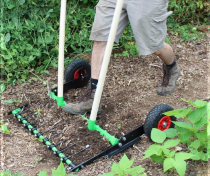

# Outils

## Jardin

### La campagnole

Invention de [la fabriculture](http://www.lafabriculture.fr/)
Vous pouvez le fabriquez vous même grâce aux [plans mis à disposition](https://pat-rice.github.io/self-sufficiency-wiki/fr/assets/documents/kit_autoconstruction_campagnole.pdf)

La Campagnole agit sur trois points:
- Ergonomie: étudiée pour favoriser une posture confortable et limiter les troubles musculosquelettiques
- Agronomie: elle respecte la vie du sol, aère les sols, brise les mottes de terre, et sort cailloux et racines du sol
- Rapidité: grâce à ses différentes largeurs et à sa facilitée d’utilisation Cet outil remplace très avantageusement les motobineuses